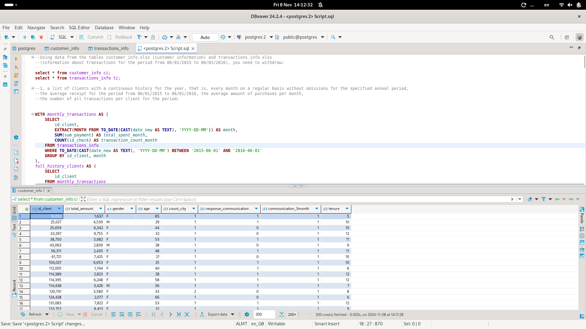
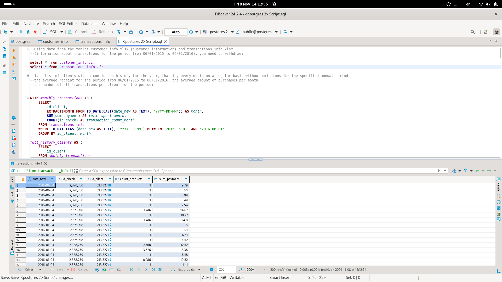
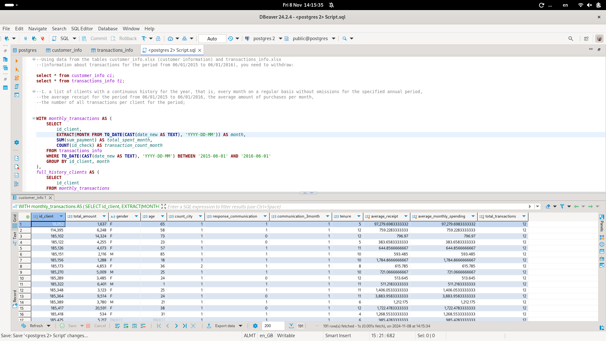
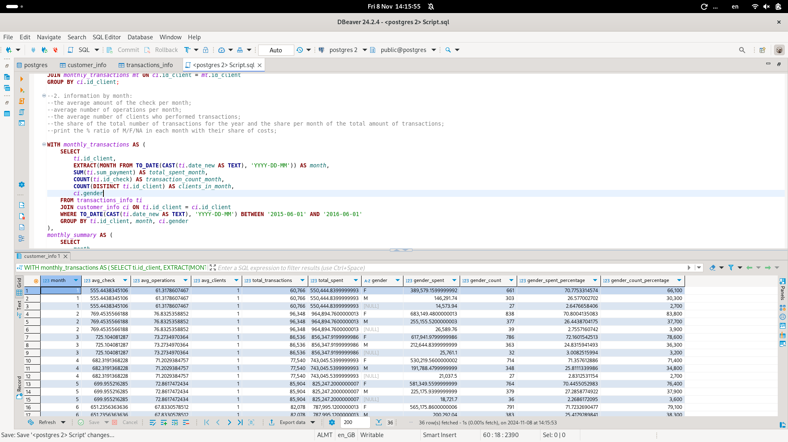
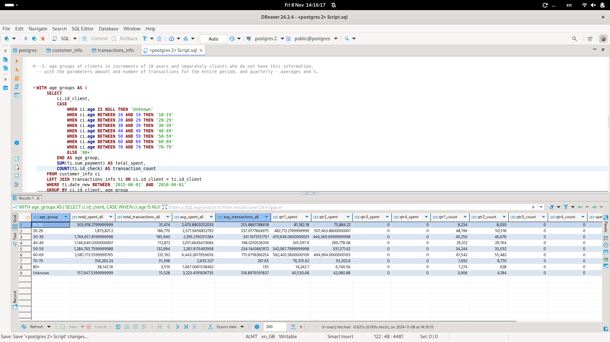

## Using data from the tables customer_info.xlsx (customer information) and transactions_info.xlsx  (information about transactions for the period from 06/01/2015 to 06/01/2016), you need to withdraw:

### 1. a list of clients with a continuous history for the year, that is, every month on a regular basis without omissions for the specified annual period, the average receipt for the period from 06/01/2015 to 06/01/2016, the average amount of purchases per month, the number of all transactions per client for the period

### 2. information by month the average amount of the check per month average number of operations per month the average number of clients who performed transactions the share of the total number of transactions for the year and the share per month of the total amount of transactions print the % ratio of M/F/NA in each month with their share of costs

### 3. age groups of clients in increments of 10 years and separately clients who do not have this information, with the parameters amount and number of transactions for the entire period, and quarterly - averages and %.

